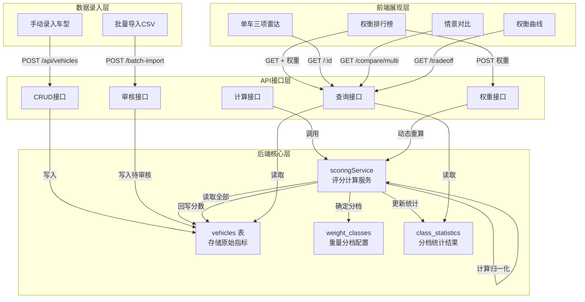
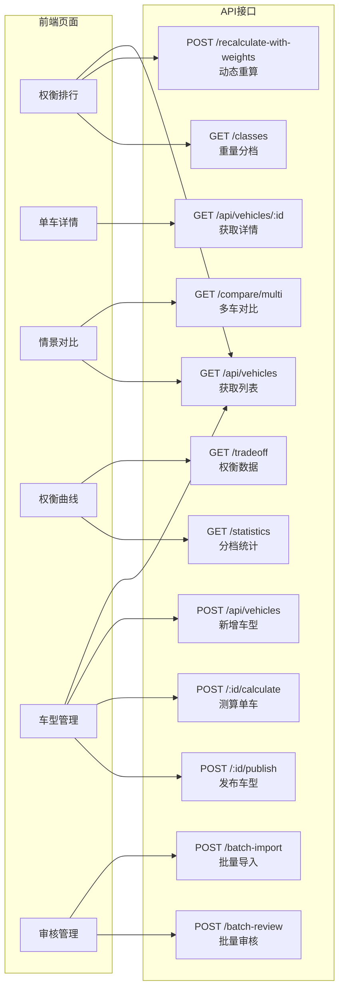

# SafeBalance 权衡评估平台 - 架构梳理文档

> 本文档梳理从**车型数据录入**到**前端图表渲染**的完整数据流，帮助接手人员快速理解整套评估体系的运行机制。

---

## 📋 目录

1. [整体架构概览](#1-整体架构概览)
2. [后端数据流详解](#2-后端数据流详解)
3. [核心评分算法](#3-核心评分算法)
4. [状态流转机制](#4-状态流转机制)
5. [API 接口清单](#5-api-接口清单)
6. [前端页面与接口消费关系](#6-前端页面与接口消费关系)
7. [核心图表数据还原逻辑](#7-核心图表数据还原逻辑)
8. [关键代码索引](#8-关键代码索引)

---

## 1. 整体架构概览

### 1.1 技术栈

| 层级 | 技术选型 | 核心文件 |
|------|----------|----------|
| 前端 | React 18 + Vite + ECharts + TailwindCSS | [frontend/src/](file:///Users/ding/Documents/SOLOCODE%203/0609/macmini/zj-00209-safebalance-5/frontend/src/) |
| 后端 | Node.js + Express + SQLite (better-sqlite3) | [backend/server.js](file:///Users/ding/Documents/SOLOCODE%203/0609/macmini/zj-00209-safebalance-5/backend/server.js) |
| 数据层 | SQLite 本地文件数据库 | [backend/data/safebalance.db](file:///Users/ding/Documents/SOLOCODE%203/0609/macmini/zj-00209-safebalance-5/backend/data/safebalance.db) |

### 1.2 端到端数据流总图



---

## 2. 后端数据流详解

### 2.1 完整数据处理链路

```
录入 → 原始指标入库 → 触发计算 → 归一化处理 → 加权求和 → 重量分档 → 分档统计 → 状态更新 → 接口输出
```

### 2.2 数据库表结构

#### 2.2.1 `vehicles` 表 - 车型主表

| 字段 | 类型 | 说明 |
|------|------|------|
| `id` | INTEGER | 主键 |
| `brand` / `model` | TEXT | 品牌型号 |
| `vehicle_class` | TEXT | 车型级别（紧凑型/中型车等） |
| `curb_weight` | INTEGER | **原始指标**：整备质量(kg) |
| `braking_distance` | REAL | **原始指标**：百公里制动距离(m) |
| `energy_consumption` | REAL | **原始指标**：百公里能耗 |
| `range` | REAL | 续航里程(km) |
| `status` | TEXT | 状态：draft / pending_review / calculated / published / rejected |
| `weight_score` | REAL | **计算结果**：轻量化得分 |
| `evasion_score` | REAL | **计算结果**：避险能力得分 |
| `energy_score` | REAL | **计算结果**：能耗经济得分 |
| `total_score` | REAL | **计算结果**：综合权衡分 |
| `weight_class` | TEXT | **分档结果**：轻型车/紧凑型/中型车/中大型/重型车 |

> 代码位置：[initDb.js](file:///Users/ding/Documents/SOLOCODE%203/0609/macmini/zj-00209-safebalance-5/backend/scripts/initDb.js#L10-L53)

#### 2.2.2 `weight_classes` 表 - 重量分档配置

| class_name | min_weight | max_weight |
|------------|------------|------------|
| 轻型车 | 0 | 1500 |
| 紧凑型 | 1500 | 1800 |
| 中型车 | 1800 | 2100 |
| 中大型 | 2100 | 2500 |
| 重型车 | 2500 | 10000 |

#### 2.2.3 `class_statistics` 表 - 分档统计

| 字段 | 说明 |
|------|------|
| `weight_class` | 重量分档 |
| `vehicle_count` | 该档车型数量 |
| `avg_braking_distance` | 平均制动距离 |
| `avg_energy_consumption` | 平均能耗 |
| `avg_evasion_score` | 平均避险得分 |
| `avg_energy_score` | 平均能耗得分 |
| `avg_total_score` | 平均综合权衡分 |

---

## 3. 核心评分算法

### 3.1 评分公式

```javascript
综合权衡分 = 轻量化得分 × 35% + 避险能力 × 40% + 能耗经济 × 25%
```

> 默认权重：`weight: 0.35, evasion: 0.4, energy: 0.25`
>
> 代码位置：[scoringService.js](file:///Users/ding/Documents/SOLOCODE%203/0609/macmini/zj-00209-safebalance-5/backend/services/scoringService.js#L3-L7)

### 3.2 归一化算法

所有原始指标先经过 **min-max 归一化** 转换为 0-100 分：

```javascript
function normalize(value, min, max, invert) {
  if (max === min) return 0.5;
  const normalized = (value - min) / (max - min);
  return invert ? (1 - normalized) : normalized;  // 反转：越小越好的指标
}
```

| 指标 | 方向 | 计算公式 |
|------|------|----------|
| 整备质量 | 越小越好 | `(1 - (weight - minW) / (maxW - minW)) × 100` |
| 制动距离 | 越小越好 | `(1 - (braking - minB) / (maxB - minB)) × 100` |
| 能耗 | 越小越好 | `(1 - (energy - minE) / (maxE - minE)) × 100` |

> **关键点**：min/max 取自 **全部车型** 的极值，保证评分是**相对排名**而非绝对值。
>
> 代码位置：[scoringService.js](file:///Users/ding/Documents/SOLOCODE%203/0609/macmini/zj-00209-safebalance-5/backend/services/scoringService.js#L21-L42)

### 3.3 重量分档逻辑

```javascript
function getWeightClass(curbWeight) {
  for (const wc of weightClasses) {
    if (curbWeight >= wc.min_weight && curbWeight < wc.max_weight) {
      return wc.class_name;
    }
  }
  return '重型车';
}
```

### 3.4 权重动态调整机制

前端拖动滑块时，后端不会修改数据库中已存的分数，而是：

1. 接收自定义权重参数
2. 从数据库读取原始指标和已存的单项分数
3. 使用新权重 **临时重新计算** 综合分和排名
4. 返回给前端实时展示

```javascript
// 前端调整权重 → 调用 POST /recalculate-with-weights
// 后端：calculateScoresWithWeights() 仅在内存中重算，不写入数据库
```

> 代码位置：[scoringService.js](file:///Users/ding/Documents/SOLOCODE%203/0609/macmini/zj-00209-safebalance-5/backend/services/scoringService.js#L106-L150)

---

## 4. 状态流转机制

### 4.1 状态流转图

```mermaid
stateDiagram-v2
    [*] --> draft: 手动录入<br/>POST /api/vehicles
    [*] --> pending_review: 批量导入<br/>POST /batch-import
    
    draft --> calculated: 点击测算<br/>POST /:id/calculate
    pending_review --> calculated: 审核通过<br/>POST /:id/review?action=approve
    pending_review --> rejected: 审核拒绝<br/>POST /:id/review?action=reject
    
    calculated --> published: 点击发布<br/>POST /:id/publish
    published --> calculated: 取消发布<br/>POST /:id/unpublish
    
    note left of draft: 可编辑、可删除<br/>可测算
    note right of calculated: 可发布、可取消发布<br/>不可编辑
    note over published: 对前端可见<br/>出现在排行榜和对比中
```

### 4.2 状态流转触发点

| 操作 | 调用接口 | 状态迁移 | 代码位置 |
|------|----------|----------|----------|
| 手动新增 | `POST /api/vehicles` | → draft | [vehicles.js#L216-L267](file:///Users/ding/Documents/SOLOCODE%203/0609/macmini/zj-00209-safebalance-5/backend/routes/vehicles.js#L216-L267) |
| 批量导入 | `POST /batch-import` | → pending_review | [vehicles.js#L132-L145](file:///Users/ding/Documents/SOLOCODE%203/0609/macmini/zj-00209-safebalance-5/backend/routes/vehicles.js#L132-L145) |
| 测算单车 | `POST /:id/calculate` | draft → calculated | [vehicles.js#L340-L363](file:///Users/ding/Documents/SOLOCODE%203/0609/macmini/zj-00209-safebalance-5/backend/routes/vehicles.js#L340-L363) |
| 审核通过 | `POST /:id/review` | pending_review → calculated | [vehicles.js#L391-L413](file:///Users/ding/Documents/SOLOCODE%203/0609/macmini/zj-00209-safebalance-5/backend/routes/vehicles.js#L391-L413) |
| 发布 | `POST /:id/publish` | calculated → published | [vehicles.js#L365-L382](file:///Users/ding/Documents/SOLOCODE%203/0609/macmini/zj-00209-safebalance-5/backend/routes/vehicles.js#L365-L382) |

### 4.3 状态权限矩阵

| 操作 | draft | pending_review | calculated | published | rejected |
|------|-------|----------------|------------|-----------|----------|
| 编辑 | ✅ | ❌ | ❌ | ❌ | ❌ |
| 测算 | ✅ | ❌ | ❌ | ❌ | ❌ |
| 审核 | ❌ | ✅ | ❌ | ❌ | ❌ |
| 发布 | ❌ | ❌ | ✅ | ❌ | ❌ |
| 删除 | ✅ | ✅ | ✅ | ✅ | ✅ |
| 前端可见 | ❌ | ❌ | ❌ | ✅ | ❌ |

---

## 5. API 接口清单

### 5.1 接口总览



### 5.2 核心接口详解

#### 5.2.1 `GET /api/vehicles/tradeoff` - 权衡曲线数据

**返回结构**：
```javascript
{
  vehicles: [
    {
      id, brand, model, vehicle_class,
      curb_weight, braking_distance, energy_consumption, range,
      evasion_score, energy_score, weight_score, total_score,
      weight_class, rank  // 排名
    },
    ...
  ],
  classStatistics: [
    { weight_class, vehicle_count, avg_braking_distance, ... },
    ...
  ],
  weights_applied: { weight: 0.35, evasion: 0.4, energy: 0.25 }
}
```

> 代码位置：[scoringService.js](file:///Users/ding/Documents/SOLOCODE%203/0609/macmini/zj-00209-safebalance-5/backend/services/scoringService.js#L265-L312)

#### 5.2.2 `POST /api/vehicles/recalculate-with-weights` - 动态权重重算

**请求参数**：
```javascript
{ weight: 0.35, evasion: 0.4, energy: 0.25 }
```

**处理逻辑**：
1. 读取所有 `status='published'` 的车型
2. 用新权重重新计算每辆车的 `total_score`
3. 按新总分排序并赋予 `rank`
4. **不写入数据库**，直接返回

> 代码位置：[scoringService.js](file:///Users/ding/Documents/SOLOCODE%203/0609/macmini/zj-00209-safebalance-5/backend/services/scoringService.js#L314-L334)

---

## 6. 前端页面与接口消费关系

### 6.1 页面路由与核心组件

| 页面 | 路由 | 核心组件 | 消费接口 |
|------|------|----------|----------|
| 权衡排行 | `/vehicles` | [VehicleList.jsx](file:///Users/ding/Documents/SOLOCODE%203/0609/macmini/zj-00209-safebalance-5/frontend/src/pages/VehicleList.jsx) | `getAll()`, `recalculateWithWeights()`, `getWeightClasses()` |
| 单车详情 | `/vehicles/:id` | [VehicleDetail.jsx](file:///Users/ding/Documents/SOLOCODE%203/0609/macmini/zj-00209-safebalance-5/frontend/src/pages/VehicleDetail.jsx) + [RadarChart.jsx](file:///Users/ding/Documents/SOLOCODE%203/0609/macmini/zj-00209-safebalance-5/frontend/src/components/RadarChart.jsx) | `getById()` |
| 情景对比 | `/compare` | [VehicleCompare.jsx](file:///Users/ding/Documents/SOLOCODE%203/0609/macmini/zj-00209-safebalance-5/frontend/src/pages/VehicleCompare.jsx) | `getAll({status:'published'})`, `getDefaultWeights()` |
| 权衡曲线 | `/tradeoff` | [TradeoffChart.jsx](file:///Users/ding/Documents/SOLOCODE%203/0609/macmini/zj-00209-safebalance-5/frontend/src/pages/TradeoffChart.jsx) | `getTradeoff()`, `getStatistics()` |
| 车型管理 | `/manage` | [VehicleManage.jsx](file:///Users/ding/Documents/SOLOCODE%203/0609/macmini/zj-00209-safebalance-5/frontend/src/pages/VehicleManage.jsx) | `getAll()`, `create()`, `calculate()`, `publish()` |
| 审核管理 | `/review` | [VehicleReview.jsx](file:///Users/ding/Documents/SOLOCODE%203/0609/macmini/zj-00209-safebalance-5/frontend/src/pages/VehicleReview.jsx) | `batchImport()`, `getPendingReview()`, `batchReview()` |

### 6.2 API 封装层

所有后端调用集中在 [api/index.js](file:///Users/ding/Documents/SOLOCODE%203/0609/macmini/zj-00209-safebalance-5/frontend/src/api/index.js)：

```javascript
export const vehiclesAPI = {
  getAll: (params) => api.get('/vehicles', { params }),
  getById: (id) => api.get(`/vehicles/${id}`),
  create: (data) => api.post('/vehicles', data),
  calculate: (id) => api.post(`/vehicles/${id}/calculate`),
  publish: (id) => api.post(`/vehicles/${id}/publish`),
  getTradeoff: () => api.get('/vehicles/tradeoff'),
  getStatistics: () => api.get('/vehicles/statistics'),
  recalculateWithWeights: (weights) => api.post('/vehicles/recalculate-with-weights', weights),
  getMultiCompare: (ids, weights) => api.get('/vehicles/compare/multi', { params: { ids: ids.join(','), ...weights } }),
  batchImport: (vehicles) => api.post('/vehicles/batch-import', { vehicles }),
  batchReview: (ids, action, reviewNote) => api.post('/vehicles/batch-review', { ids, action, review_note: reviewNote }),
  // ...
};
```

---

## 7. 核心图表数据还原逻辑

### 7.1 权衡排行榜（VehicleList.jsx）

**数据流**：
```
GET /api/vehicles?status=published&sort_by=total_score
    ↓
返回 vehicles 数组（包含 total_score 等计算字段）
    ↓
前端按 weight_score/evasion_score/energy_score 渲染进度条
    ↓
点击行 → 选中车型 → 传递给 RadarChart 组件 → 渲染三项雷达
    ↓
拖动 WeightSlider → 防抖 300ms → POST /recalculate-with-weights
    ↓
返回重算后的 vehicles（带新 rank）→ 更新表格排序和分数
```

### 7.2 单车三项雷达（RadarChart.jsx）

**数据映射**：

| 雷达轴 | 后端字段 | 取值范围 |
|--------|----------|----------|
| 轻量化得分 | `weight_score` | 0-100 |
| 避险能力 | `evasion_score` | 0-100 |
| 能耗经济性 | `energy_score` | 0-100 |

**ECharts 配置**：
```javascript
// RadarChart.jsx
indicator: [
  { name: '轻量化得分', max: 100 },
  { name: '避险能力', max: 100 },
  { name: '能耗经济性', max: 100 },
],
data: [{
  value: [vehicle.weight_score, vehicle.evasion_score, vehicle.energy_score],
  name: '综合权衡'
}]
```

> 代码位置：[RadarChart.jsx](file:///Users/ding/Documents/SOLOCODE%203/0609/macmini/zj-00209-safebalance-5/frontend/src/components/RadarChart.jsx#L10-L66)

### 7.3 情景对比（VehicleCompare.jsx）

**数据流**：
```
GET /api/vehicles?status=published → 获取所有已发布车型
    ↓
用户选择 2-4 款车型 → 本地计算对比
    ↓
├─ 多雷达叠加：每款车一个 data series，不同颜色区分
├─ 柱状图：每款车的 total_score 对比
└─ 指标对比表：逐行对比 curb_weight/braking_distance/energy_consumption 等
    ↓
自动计算每列的最优值（✓ 标记），生成情景分析结论
```

**多雷达配置**：
```javascript
// VehicleCompare.jsx
series: [{
  type: 'radar',
  data: selectedVehicles.map((v, idx) => ({
    value: [v.weight_score, v.evasion_score, v.energy_score],
    name: `${v.brand} ${v.model}`,
    lineStyle: { color: VEHICLE_COLORS[idx].main, width: 2 },
    areaStyle: { color: `${VEHICLE_COLORS[idx].main}33` },  // 透明填充
  }))
}]
```

### 7.4 权衡曲线（TradeoffChart.jsx）

**三张图表的数据来源**：

| 图表 | X轴 | Y轴 | 附加维度 | 数据源字段 |
|------|-----|-----|----------|------------|
| 车重vs制动散点图 | `curb_weight` | `braking_distance` | 点大小=`energy_consumption`<br/>颜色=`weight_class` | `getTradeoff().vehicles` |
| 分档指标趋势图 | `weight_class` | 左Y：`avg_braking_distance`<br/>右Y1：`avg_energy_consumption`<br/>右Y2：`avg_total_score` | - | `getStatistics()` |
| 综合得分分布图 | 车型名称（按车重排序） | 三条线：`evasion_score` / `energy_score` / `total_score` | - | `getTradeoff().vehicles` |

**散点图配置关键点**：
```javascript
// TradeoffChart.jsx  getWeightScatterOption()
symbolSize: (data) => Math.max(12, Math.min(30, data[2] * 1.2)),  // 能耗决定点大小
data: vehicles.map(v => ({
  value: [v.curb_weight, v.braking_distance, v.energy_consumption, v.total_score],
  itemStyle: { color: classColors[v.weight_class] }  // 分档决定颜色
}))
```

---

## 8. 关键代码索引

### 8.1 后端核心文件

| 文件 | 职责 | 关键函数 |
|------|------|----------|
| [server.js](file:///Users/ding/Documents/SOLOCODE%203/0609/macmini/zj-00209-safebalance-5/backend/server.js) | 服务入口、自动初始化 | `autoInitialize()`, `ensureTablesExist()` |
| [services/scoringService.js](file:///Users/ding/Documents/SOLOCODE%203/0609/macmini/zj-00209-safebalance-5/backend/services/scoringService.js) | 评分计算核心 | `calculateScores()`, `normalize()`, `getWeightClass()`, `recalculateWithWeights()`, `recalculateClassStatistics()` |
| [routes/vehicles.js](file:///Users/ding/Documents/SOLOCODE%203/0609/macmini/zj-00209-safebalance-5/backend/routes/vehicles.js) | API 路由层 | 所有 REST 接口 |
| [scripts/initDb.js](file:///Users/ding/Documents/SOLOCODE%203/0609/macmini/zj-00209-safebalance-5/backend/scripts/initDb.js) | 数据库初始化 | 建表、分档配置 |

### 8.2 前端核心文件

| 文件 | 职责 | 关键组件 |
|------|------|----------|
| [api/index.js](file:///Users/ding/Documents/SOLOCODE%203/0609/macmini/zj-00209-safebalance-5/frontend/src/api/index.js) | API 封装 | `vehiclesAPI` 对象 |
| [components/RadarChart.jsx](file:///Users/ding/Documents/SOLOCODE%203/0609/macmini/zj-00209-safebalance-5/frontend/src/components/RadarChart.jsx) | 三项雷达图 | `RadarChart` |
| [components/WeightSlider.jsx](file:///Users/ding/Documents/SOLOCODE%203/0609/macmini/zj-00209-safebalance-5/frontend/src/components/WeightSlider.jsx) | 权重调节器 | `WeightSlider` |
| [components/Layout.jsx](file:///Users/ding/Documents/SOLOCODE%203/0609/macmini/zj-00209-safebalance-5/frontend/src/components/Layout.jsx) | 布局和工具函数 | `getStatusBadge()`, `getScoreColor()`, `getScoreBg()` |
| [pages/VehicleList.jsx](file:///Users/ding/Documents/SOLOCODE%203/0609/macmini/zj-00209-safebalance-5/frontend/src/pages/VehicleList.jsx) | 权衡排行榜 | 表格 + 权重 + 侧边雷达 |
| [pages/VehicleDetail.jsx](file:///Users/ding/Documents/SOLOCODE%203/0609/macmini/zj-00209-safebalance-5/frontend/src/pages/VehicleDetail.jsx) | 单车详情 | 指标卡片 + 雷达 + 进度条 |
| [pages/VehicleCompare.jsx](file:///Users/ding/Documents/SOLOCODE%203/0609/macmini/zj-00209-safebalance-5/frontend/src/pages/VehicleCompare.jsx) | 多车对比 | 多雷达 + 柱状图 + 对比表 |
| [pages/TradeoffChart.jsx](file:///Users/ding/Documents/SOLOCODE%203/0609/macmini/zj-00209-safebalance-5/frontend/src/pages/TradeoffChart.jsx) | 权衡曲线 | 散点图 + 趋势图 + 分布图 |

---

## 🎯 快速理解 Checklist

1. ✅ **数据起点**：车型指标通过手动录入或批量导入进入 `vehicles` 表，状态为 `draft` 或 `pending_review`
2. ✅ **计算触发**：测算或审核通过时，调用 `calculateScores()`，基于**全部车型**的极值做归一化
3. ✅ **评分公式**：`综合分 = 轻量化×35% + 避险×40% + 能耗×25%`，权重可动态调整
4. ✅ **分档逻辑**：按 `curb_weight` 归入 5 个重量档位，触发 `recalculateClassStatistics()` 更新统计
5. ✅ **状态流转**：`draft → calculated → published`，批量导入多一层 `pending_review` 审核
6. ✅ **前端渲染**：
   - 排行榜：消费 `GET /api/vehicles`，表格 + 侧边雷达
   - 单车雷达：消费 `GET /api/vehicles/:id`，映射三个 `*_score` 字段到雷达轴
   - 情景对比：消费 `GET /api/vehicles?status=published`，本地做多雷达叠加
   - 权衡曲线：消费 `GET /tradeoff` + `GET /statistics`，三张图表各取所需字段
7. ✅ **权重调整**：前端拖动滑块 → POST `/recalculate-with-weights` → 后端内存重算 → 返回新排名
